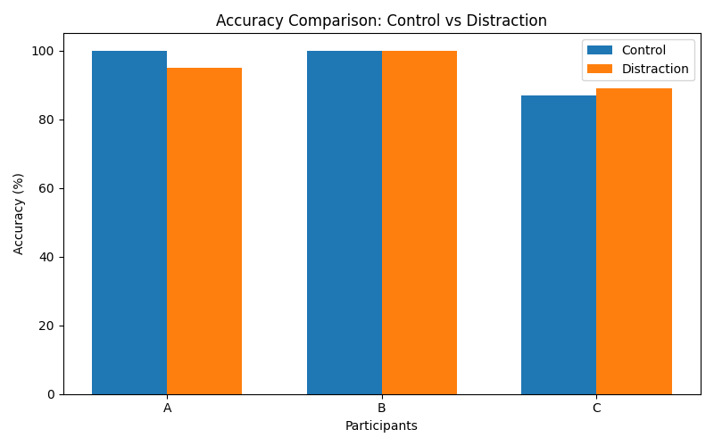
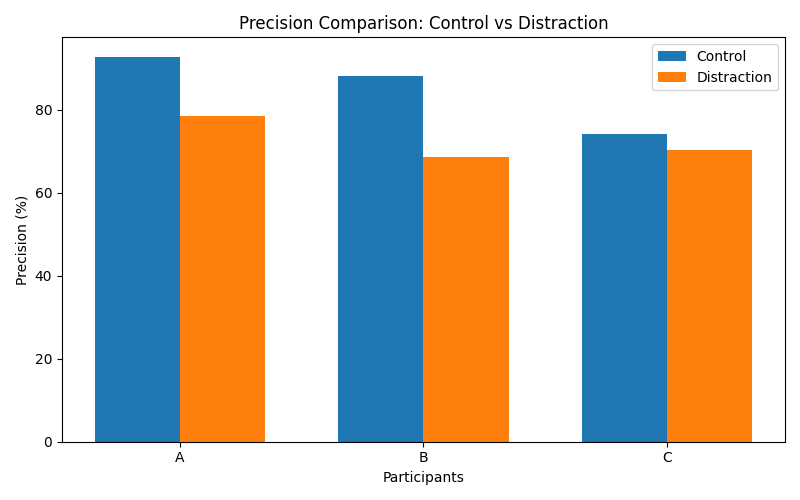
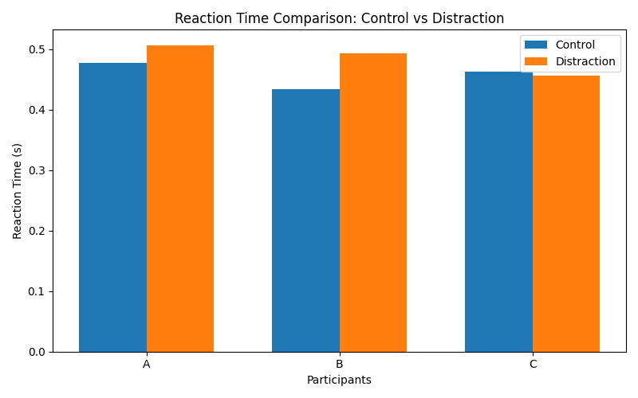
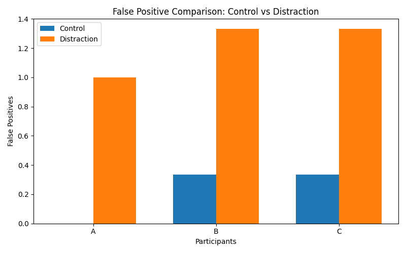

# Attention and Distraction Experiment

## Abstract

This project explores how perceptual distractions and misleading visual stimuli influence selective attention response precision and reaction time during rapid target detection tasks. A Python based experimental system was designed to simulate both controlled and distraction heavy visual environments. Participants were required to identify target stimuli within rapid character streams while distraction conditions introduced visual clutter misleading lowercase signals shifting layouts and burst noise patterns. Experimental data was collected across multiple sessions and analyzed using accuracy precision false positives and reaction time metrics.

---

## Objective

The objective of this experiment was to investigate how attentional performance changes under perceptual interference conditions. Instead of measuring only whether participants could identify targets the experiment aimed to observe how distractions influence response reliability impulsive reactions and attentional filtering.

---

## Experimental Design

The experiment consisted of two primary conditions:

### Control Condition

Participants viewed rapid streams of uppercase characters and pressed ENTER whenever the target character X appeared.

### Distraction Condition

Additional interference elements were introduced including:
- visual symbol clutter
- randomized layout positioning
- misleading lowercase x signals
- burst noise patterns
- increased probability of visually similar characters such as K Y V and W

The order of conditions was randomized across trials to reduce adaptation and anticipation effects.

---

## Participants and Sessions

The experiment included:
- 3 participants
- 3 sessions per participant
- multiple trials under both conditions

Using repeated sessions helped reduce one time variability and allowed more stable behavioral observations.

---

## Variables Measured

The following metrics were recorded:

- Accuracy Percentage
- Precision Percentage
- False Positives
- Average Reaction Time

These variables were used to evaluate both attentional stability and impulsive response behavior under distraction.

---

## Cognitive Basis

This experiment primarily explored selective attention under perceptual interference conditions. Rather than testing attention in a completely isolated environment the task was designed to introduce competing visual signals that participants needed to continuously filter while identifying targets.

Several distraction mechanisms were intentionally combined. Misleading lowercase x characters visually resembled the actual target while randomized symbol layouts prevented participants from adapting to fixed spatial patterns. Visually similar letters such as K Y V and W were also introduced more frequently to increase perceptual competition during rapid detection.

An important aspect of the experiment was that participants were not only required to identify targets quickly but also suppress impulsive responses to misleading stimuli. This made the task less focused on simple reaction speed and more focused on attentional filtering consistency and response selectivity under unpredictable visual conditions.

---

## Results

### Accuracy Comparison

Overall target detection accuracy remained relatively stable across many trials although some decline was observed under distraction conditions for certain participants.

---

### Precision Comparison

Precision showed more noticeable reduction under distraction conditions. Participants often continued responding rapidly but produced more impulsive or incorrect responses when misleading stimuli and clutter were introduced.

---

### Reaction Time Comparison

Reaction times generally increased slightly during distraction conditions suggesting additional cognitive processing demands during attentional filtering.

---

### False Positive Comparison

False positives increased more frequently during distraction trials indicating greater susceptibility to misleading signals and perceptual interference.

---

## Observations and Interpretation

One of the most noticeable observations was that distraction conditions did not always cause large reductions in overall target detection accuracy. In several cases participants continued identifying most targets successfully even when interference elements were introduced.

However precision and false positive patterns revealed a more subtle effect. Participants often appeared to preserve responsiveness while becoming more vulnerable to impulsive or less selective reactions. Misleading lowercase signals cluttered layouts and perceptual unpredictability increased incorrect responses even when overall detection rates remained relatively stable.

This distinction became one of the more interesting outcomes of the experiment. The results suggested that distractions may influence how selectively participants respond rather than simply whether they detect targets at all.

Differences between participants also became noticeable across sessions. Some participants maintained stable reaction behavior while others showed larger variability under distraction conditions. Although the sample size was limited these variations highlighted how attentional control and susceptibility to interference can differ across individuals.

---

## Limitations

Several limitations were present during experimentation:

- small participant sample size
- varying familiarity with keyboard response tasks
- home based testing environment
- limited session duration
- simplified experimental setup compared to formal laboratory systems

Despite these limitations the project still provided meaningful exploratory behavioral patterns.

---

## Future Scope

Possible future extensions include:
- adaptive distraction intensity
- larger participant groups
- eye tracking integration
- auditory distraction systems
- fatigue and sleep correlation analysis
- machine learning based attentional trend analysis

---

## Technologies Used

- Python
- Pandas
- Matplotlib
- CSV based data logging

---

## Repository Structure

The repository contains:
- experiment source code
- graph generation scripts
- collected experimental datasets
- generated visualizations
- project documentation

---

## Conclusion

This project began as a small attempt to explore how distractions influence attention but gradually developed into a broader investigation of attentional filtering and response behavior under perceptual interference.

Rather than focusing only on whether participants detected targets correctly the experiment attempted to examine how environmental complexity influences response selectivity impulsive reactions and attentional consistency. The results suggested that distractions do not always strongly reduce overall responsiveness but can subtly affect the quality and precision of attentional control.

Building the system also highlighted the importance of experimental structure randomization and variable design while exploring cognitive processes computationally. Although simplified compared to formal laboratory research the project provided a meaningful exploratory framework for understanding how attention behaves under competing visual conditions.