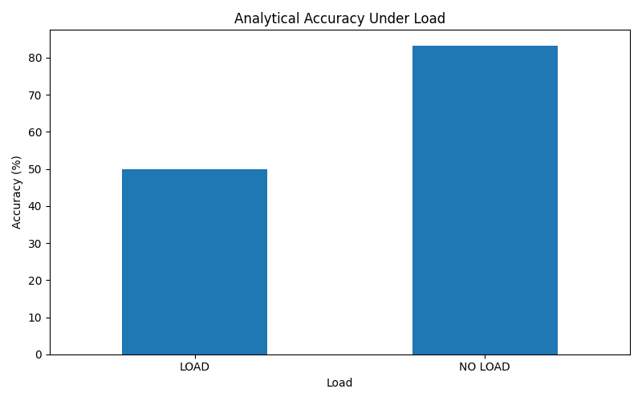
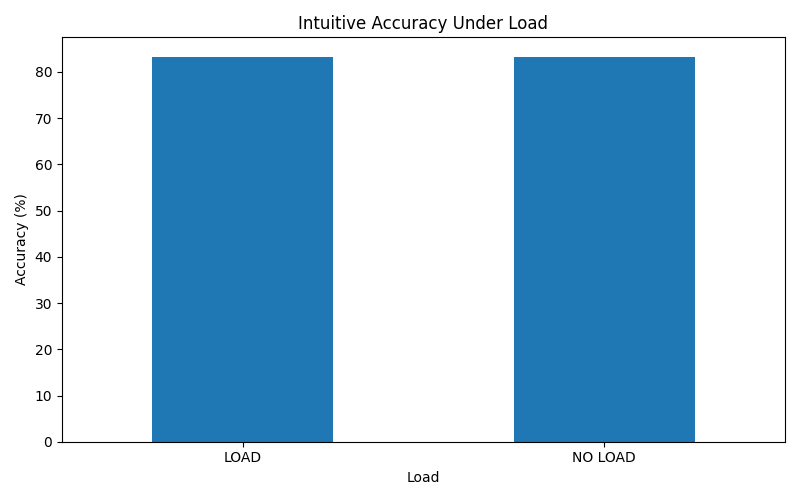
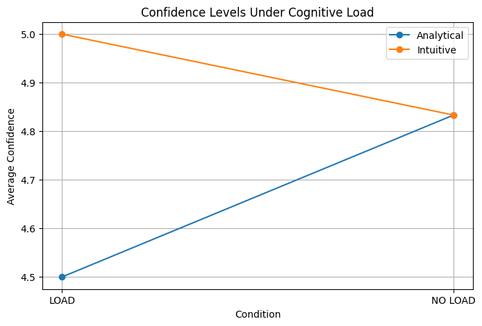

# Decision Making Under Cognitive Load

## Objective
To investigate how short-term memory load influences analytical reasoning, intuitive decision-making, confidence levels, response time, and risk preference.

---

## Research Question
How does cognitive load affect human reasoning accuracy, confidence, and decision behavior across different types of cognitive tasks?

---

## Experimental Design

Participants completed three categories of tasks:

- Intuitive reasoning questions
- Analytical reasoning questions
- Risk-based decision scenarios

Each category was tested under:

- Load condition
- No-load condition

During load trials, participants first memorized a 4-digit sequence before answering the question and later recalled the sequence.

This introduced working memory interference during decision-making.

---

## Variables Measured

### Independent Variable
- Presence or absence of cognitive load

### Dependent Variables
- Decision accuracy
- Response time
- Confidence levels
- Memory recall accuracy
- Risk preference selection

---

## Methodology

The program randomized all trial orders to reduce prediction effects and participant adaptation.

For each load trial:

1. Participants memorized a digit sequence
2. Completed a reasoning or decision task
3. Reported confidence level
4. Recalled the memorized sequence

All results were automatically logged into CSV format using Python.

---

## Cognitive Concepts Explored

This experiment explores several principles from cognitive psychology and behavioral science:

- Working memory interference
- Cognitive load theory
- Dual-process reasoning
- Decision-making under mental strain
- Confidence versus accuracy relationships
- Risk behavior during cognitive interference

---

## Technologies Used

- Python
- CSV data logging
- Randomized trial generation
- Pandas
- Matplotlib

---

## Key Observations

### Analytical Reasoning

Analytical performance generally declined under cognitive load conditions.

Participants often required longer response times and showed lower reasoning accuracy while simultaneously maintaining memory information.

### Intuitive Decisions

Intuitive reasoning appeared more resistant to interference compared to analytical reasoning.

Some participants maintained strong intuitive performance despite memory load.

### Confidence Levels

Confidence scores remained relatively stable even when analytical accuracy decreased.

This suggests participants were not always fully aware of performance reduction caused by cognitive strain.

### Risk Preference

Risk behavior varied across participants.

Some participants shifted toward safer choices under load, while others showed little change.

### Memory Recall

More cognitively demanding analytical tasks occasionally reduced memory recall performance, suggesting competition for working memory resources.

---

## Graphical Analysis

### Analytical Accuracy Comparison

### Intuitive Accuracy Comparison

### Response Time Comparison

### Confidence Level Comparison

### Risk Preference Distribution

---

## Conclusions

The experiment suggests that cognitive load affects analytical reasoning more strongly than intuitive decision-making.

Working memory interference increased response time and reduced analytical accuracy for several participants.

The findings support cognitive theories proposing that analytical processing requires greater mental resources than intuitive reasoning.

The experiment also demonstrates that subjective confidence may remain high despite measurable reductions in objective performance.

---

## Limitations

- Small participant sample size
- Limited trial count
- Simplified testing environment
- Variability in participant familiarity with mental arithmetic

---

## Future Scope

Potential future improvements include:

- Larger participant populations
- Adaptive difficulty systems
- Eye-tracking analysis
- EEG or biometric integration
- Statistical hypothesis testing
- Real-world multitasking simulations

---

## Repository Contents

- `decision_memoryload.py`
- `decision_load_results.csv`
- `graphs.py`
- `graphs/`
- `report.md`