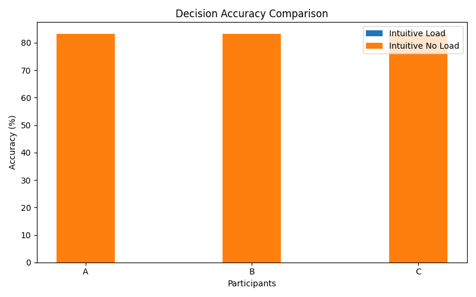
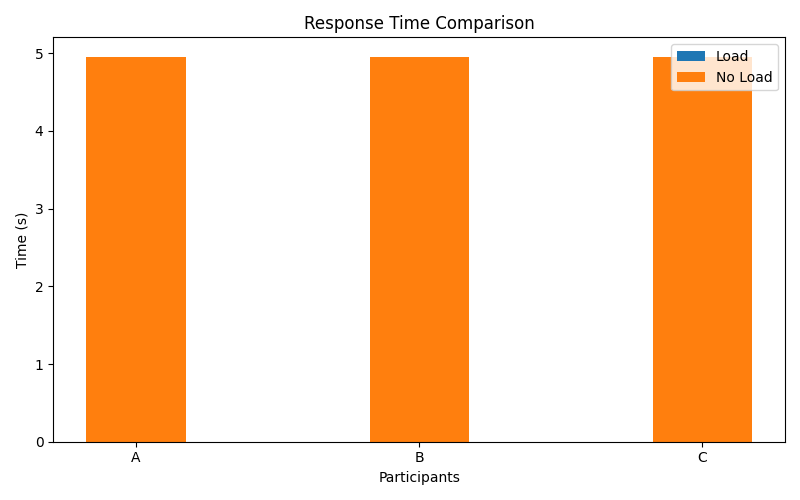
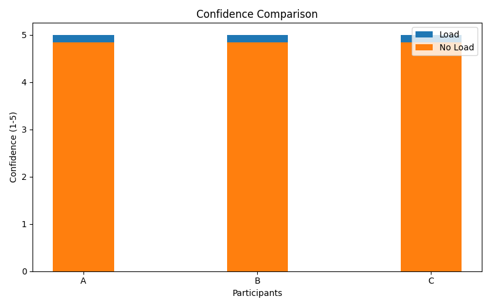
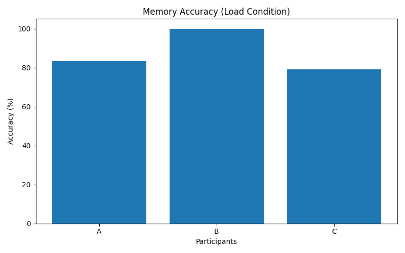
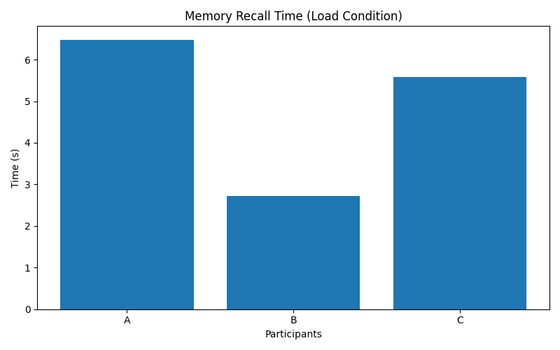
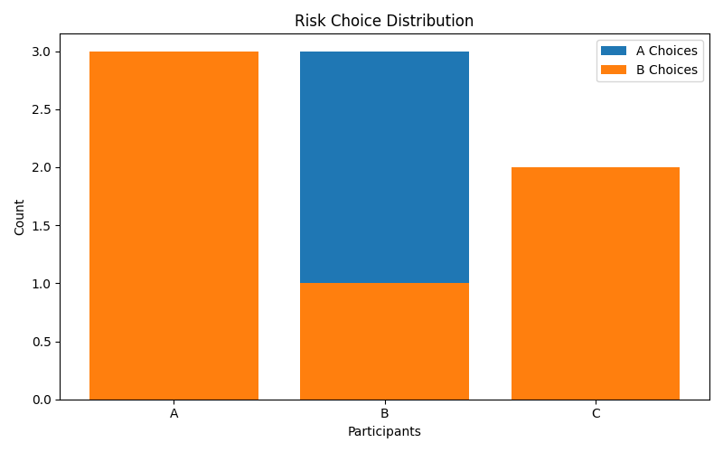

# Decision Making Under Cognitive Load Experiment

## Abstract

This project explores how cognitive load influences decision-making performance, response time, confidence levels, and risk-based choice behavior under structured cognitive tasks. A Python-based experimental system was developed to simulate dual-task conditions where participants performed decision-making tasks while simultaneously engaging in memory retention activities. Experimental data was collected across multiple sessions and analyzed using decision accuracy, response time, confidence ratings, risk preference patterns, and memory recall metrics.

---

## Objective

The objective of this experiment was to study how working memory load affects decision-making behavior. Instead of measuring only correctness of responses, the experiment aimed to observe how cognitive load influences reasoning accuracy, response speed, confidence stability, and risk-taking patterns.

---

## Experimental Design

The experiment consisted of two primary conditions:

### Control Condition
Participants performed decision-making tasks (intuitive, analytical, and risk-based) without any memory interference.

### Load Condition
Participants performed the same decision tasks while simultaneously memorizing and recalling a 4-digit sequence, introducing working memory interference.

The order of conditions and tasks was randomized across trials to reduce adaptation and prediction effects.

---

## Participants and Sessions

The experiment included:
- 3 participants
- 3 sessions per participant
- multiple trials under both conditions

Using repeated sessions helped reduce one-time variability and allowed more stable behavioral observations.

---

## Variables Measured

The following metrics were recorded:

- Decision Accuracy
- Response Time
- Confidence Levels
- Risk Choice Distribution (A vs B)
- Memory Recall Accuracy (Load condition only)
- Memory Recall Time (Load condition only)

---

## Cognitive Basis

This experiment is based on working memory limitation theory and dual-task interference in cognitive psychology. Cognitive load reduces available attentional resources, forcing participants to divide processing between memory retention and decision-making.

The arithmetic memory task in the load condition was designed to simulate real-world multitasking situations where individuals must retain information while making decisions.

The study focuses on how different cognitive processes behave under interference:
- intuitive reasoning (heuristic-based)
- analytical reasoning (structured computation)
- risk-based decision making (probabilistic choice)

---

## Results

### Decision Accuracy Comparison

---

### Response Time Comparison

---

### Confidence Comparison

---

### Memory Performance (Load Condition Only)

---

### Risk Choice Distribution

---

## Observations and Interpretation

Analytical reasoning shows greater sensitivity to cognitive load compared to intuitive reasoning, with noticeable reductions in accuracy and increases in response time.
Intuitive reasoning remains relatively stable, suggesting reliance on heuristic processing under cognitive strain.
Risk-based decisions show variability under load conditions, indicating that working memory interference influences decision consistency.
Memory performance significantly declines under load conditions, confirming the expected effect of working memory interference.
Confidence levels remain relatively stable, suggesting that subjective confidence does not always reflect actual performance degradation.

---

## Limitations

- Small participant sample size
- Limited number of trials per condition
- Simplified experimental environment
- No physiological measurements
- Controlled simulation instead of real-world environment

---

## Future Scope

- Larger participant groups
- Statistical significance testing (t-tests / ANOVA)
- Adaptive cognitive load variation
- Integration of physiological tracking (EEG, eye tracking)
- Machine learning-based prediction of decision behavior

---

## Technologies Used

- Python
- Pandas
- Matplotlib
- CSV-based data logging
- Randomized experimental design

---

## Conclusion

This project demonstrates that cognitive load significantly affects decision-making performance, particularly in analytical reasoning and memory-dependent tasks.
While intuitive reasoning remains relatively stable, analytical reasoning and response time are strongly affected under working memory interference.
Memory load reduces recall performance and increases retrieval time, confirming dual-task interference effects.
Risk-based decisions also show variability, suggesting that cognitive load affects consistency in probabilistic reasoning.
Overall, the experiment provides a structured computational framework for analyzing decision-making behavior under cognitive load.