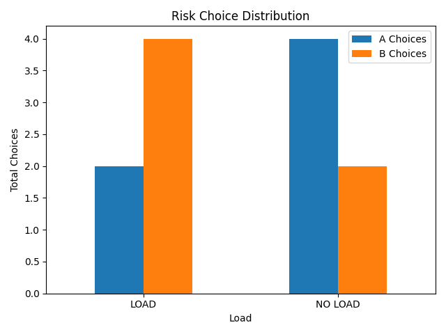

# Decision Making Under Cognitive Load

## Objective
The objective of this experiment was to investigate how cognitive load influences human decision-making, analytical reasoning, intuitive judgment, confidence levels, and risk preference.

The experiment aimed to simulate situations where the brain must process information while simultaneously maintaining short-term memory, similar to real-world multitasking conditions.

---

## Research Question
How does the presence of cognitive load affect:
- analytical reasoning accuracy,
- intuitive decision performance,
- confidence levels,
- response time,
- and risk-taking behavior?

---

## Hypothesis
It was hypothesized that:
- analytical reasoning performance would decline under cognitive load,
- response times would increase during cognitively demanding tasks,
- intuitive decisions would remain comparatively stable,
- and cognitive load could alter risk preference patterns.

---

## Experimental Design

### Participants
Three participants completed the experiment across randomized trial conditions.

### Conditions
Two primary conditions were tested:

1. **No-Load Condition**
   - Participants answered questions directly.

2. **Cognitive Load Condition**
   - Participants first memorized a 4-digit sequence.
   - The sequence had to be recalled after answering the question.

---

## Types of Decision Tasks

### 1. Intuitive Questions
Fast, instinctive reasoning problems designed to trigger immediate responses.

Examples:
- Bat and ball problem
- Relative ranking problems
- Pattern-based logic questions

### 2. Analytical Questions
Calculation-based and logically structured problems requiring deliberate reasoning.

Examples:
- Arithmetic operations
- Machine-time reasoning
- Percentage calculations

### 3. Risk-Based Decisions
Participants selected between:
- guaranteed rewards,
- or probabilistic higher-value rewards.

This section examined changes in risk preference under cognitive load.

---

## Variables Measured

### Independent Variable
- Presence or absence of cognitive load.

### Dependent Variables
- Decision accuracy
- Response time
- Confidence level
- Memory recall accuracy
- Risk preference distribution

---

## Technologies Used
- Python
- CSV data logging
- Randomized trial generation
- Matplotlib data visualization

---

## Methodology

1. Trials were randomized to reduce prediction effects.
2. Participants completed:
   - intuitive,
   - analytical,
   - and risk-based tasks.
3. During load trials:
   - participants memorized a digit sequence before solving the task.
4. Confidence was self-reported on a scale from 1–5.
5. Results were automatically stored in CSV format.

---

## Data Visualization

### Analytical Accuracy Under Load

### Intuitive Accuracy Comparison

### Confidence Levels Across Conditions

### Memory Recall Accuracy

### Risk Preference Distribution

### Response Time Comparison

---

## Key Observations

### 1. Analytical Reasoning Was Most Affected
Analytical task accuracy consistently declined under cognitive load for multiple participants.

This suggests that:
- working memory interference negatively impacts deliberate reasoning processes.

---

### 2. Intuitive Decisions Were More Stable
Intuitive questions showed comparatively smaller performance changes.

This may indicate that:
- intuitive processing relies less heavily on active working memory resources.

---

### 3. Response Time Increased During Load Conditions
Participants generally required more time to answer questions while simultaneously maintaining memory sequences.

---

### 4. Confidence Did Not Always Reflect Accuracy
Several participants maintained high confidence levels despite reduced analytical performance under load.

This demonstrates a separation between:
- perceived certainty,
- and actual cognitive performance.

---

### 5. Risk Preferences Shifted Across Conditions
Some participants displayed different choices during cognitive load trials, suggesting that mental load may influence risk evaluation behavior.

---

## Cognitive Interpretation

The experiment demonstrates several important psychological concepts:

- Working memory limitations
- Cognitive resource competition
- Dual-process reasoning systems
- Confidence-performance dissociation
- Decision instability under mental strain

The results align with theories suggesting that analytical reasoning requires greater cognitive resources than intuitive processing.

---

## Limitations
- Small participant sample size
- Limited trial count
- Human variability in confidence reporting
- Simplified laboratory-style task environment

---

## Future Improvements
Future versions could include:
- larger participant groups,
- adaptive difficulty scaling,
- statistical significance testing,
- physiological stress measurements,
- and graphical user interfaces.

Potential expansion into:
- educational psychology,
- cognitive neuroscience,
- and human-computer interaction research is also possible.

---

## Conclusion
This experiment successfully demonstrated measurable effects of cognitive load on decision-making behavior.

The findings suggest that:
- analytical reasoning becomes less reliable under working memory pressure,
- response times increase,
- and confidence does not always accurately reflect performance quality.

The project highlights how computational experimentation can be used to model and study human cognitive behavior using programmable psychological testing systems.