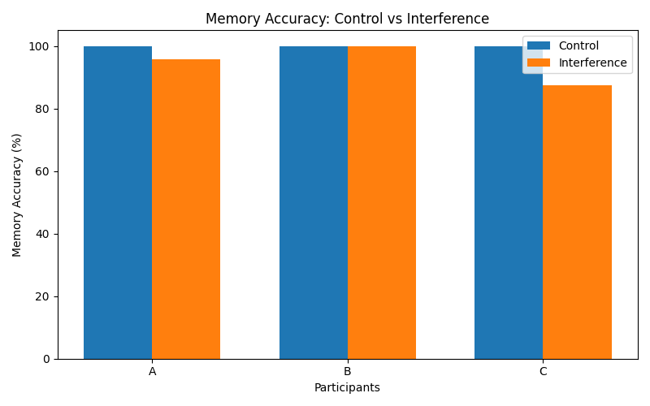
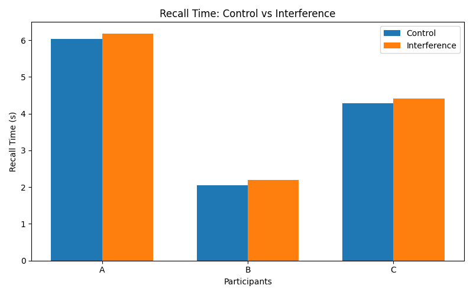
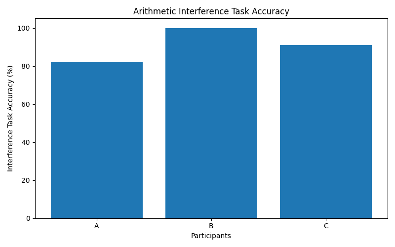
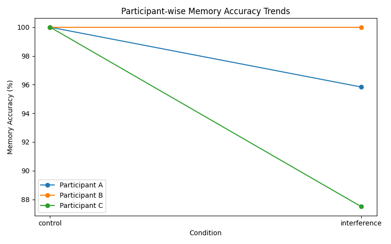

# Memory Interference Experiment

## Abstract

This project investigates how cognitive interference influences short term memory retention recall accuracy and retrieval speed under divided attention conditions. A Python based experimental system was developed to compare direct memory recall performance against recall performed after interference tasks. Participants memorized randomized numerical sequences under both control and interference conditions while experimental data was collected across multiple sessions. Performance was analyzed using memory accuracy recall time and interference task accuracy metrics.

---

## Objective

The objective of this experiment was to explore how introducing competing cognitive tasks affects working memory performance. Instead of measuring memory as simple correct or incorrect recall the experiment aimed to observe how mental interference influences recall stability retrieval consistency and short term retention under cognitive load.

---

## Experimental Design

The experiment consisted of two primary conditions:

### Control Condition

Participants memorized randomized 4 number sequences and directly recalled them after memorization.

### Interference Condition

Participants memorized the same type of sequences but completed timed arithmetic tasks before recall. These interference tasks were designed to introduce cognitive load and disrupt active rehearsal processes during retention.

The sequence and condition order were randomized across trials to reduce adaptation effects and prediction patterns.

---

## Participants and Sessions

The experiment included:
- 3 participants
- 3 sessions per participant
- multiple trials under both conditions

Using repeated sessions allowed more stable behavioral observations and reduced the effect of one time variability during testing.

---

## Variables Measured

The following metrics were recorded:

- Memory Recall Accuracy
- Recall Response Time
- Interference Task Accuracy

These variables were used to evaluate both memory retention quality and the effect of divided attention on retrieval performance.

---

## Cognitive Basis

This experiment primarily focused on working memory and interference effects under divided attention conditions. Participants were required not only to temporarily retain information but also manage competing mental activity before recall.

The arithmetic interference tasks were intentionally introduced to occupy cognitive resources that would otherwise support active rehearsal of the memorized sequences. This created a simplified model of how competing mental processes can interfere with short term retention.

An important aspect of the experiment was that memory performance was evaluated positionally rather than as entirely correct or incorrect recall. Partial sequence accuracy allowed more detailed observation of how recall degrades under cognitive interference instead of reducing performance to binary outcomes.

---

## Results

### Memory Accuracy Comparison

Memory recall accuracy generally remained higher during control trials while several participants showed noticeable reductions under interference conditions.

---

### Recall Time Comparison

Recall times showed moderate variation across conditions suggesting that cognitive interference increased retrieval effort and recall instability for certain participants.

---

### Interference Task Accuracy

Interference task performance remained relatively high across participants indicating that participants were actively engaging with the arithmetic tasks during divided attention trials.

---

### Participant-wise Memory Trends

Participant level comparisons showed variability in susceptibility to interference. Some participants maintained relatively stable recall while others demonstrated larger reductions in memory accuracy under cognitive load.

---

## Observations and Interpretation

One of the more interesting observations was that interference did not affect all participants equally. Some participants maintained near stable memory performance even while solving arithmetic tasks whereas others showed more noticeable reductions in recall accuracy.

The experiment also suggested that memory interference is not simply caused by forgetting alone but may result from competition between active mental processes. Arithmetic tasks appeared to disrupt rehearsal and retrieval consistency rather than completely preventing recall itself.

Another important observation was that partial positional scoring revealed more nuanced patterns than simple right or wrong evaluation. In several trials participants remembered portions of sequences correctly while losing ordering accuracy under interference conditions.

Although the sample size was limited the experiment still highlighted how working memory performance can vary across individuals when cognitive load is introduced.

---

## Limitations

Several limitations were present during experimentation:

- small participant sample size
- simplified memory task structure
- home based testing environment
- varying familiarity with rapid recall tasks
- limited experimental duration

Despite these limitations the experiment still provided meaningful exploratory observations regarding interference effects on working memory.

---

## Future Scope

Possible future extensions include:
- variable sequence lengths
- adaptive interference difficulty
- auditory interference conditions
- fatigue and sleep correlation analysis
- larger participant groups
- statistical modeling of working memory performance

---

## Technologies Used

- Python
- Pandas
- Matplotlib
- CSV based data logging

---

## Repository Structure

The repository contains:
- experiment source code
- graph generation scripts
- collected datasets
- generated visualizations
- project documentation

---

## Conclusion

This project began as an attempt to explore memory under interference conditions but gradually developed into a broader investigation of working memory stability under divided attention.

Rather than measuring memory as a purely binary process the experiment attempted to examine how competing mental activity influences recall quality retrieval consistency and positional accuracy. The results suggested that cognitive interference does not always completely disrupt recall but can subtly affect how reliably information is maintained and reconstructed.

Building the experiment also highlighted the importance of experimental structure randomization and behavioral interpretation while computationally exploring cognitive processes. Although simplified compared to formal laboratory systems the project provided a meaningful exploratory framework for understanding how working memory behaves under cognitive load.