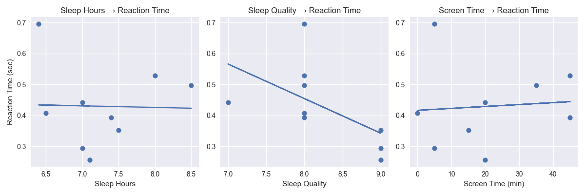
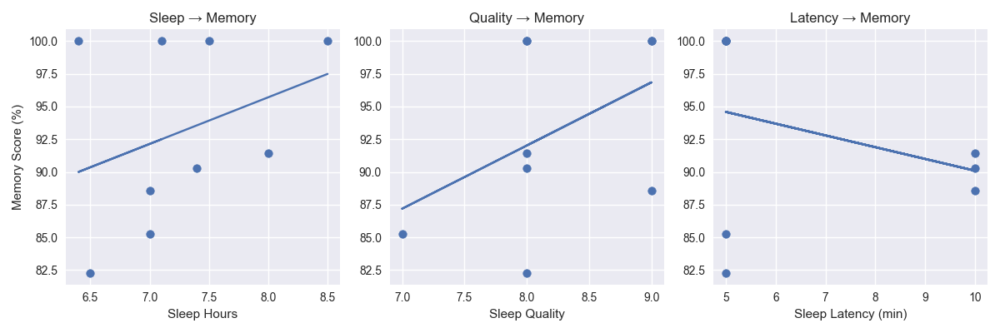
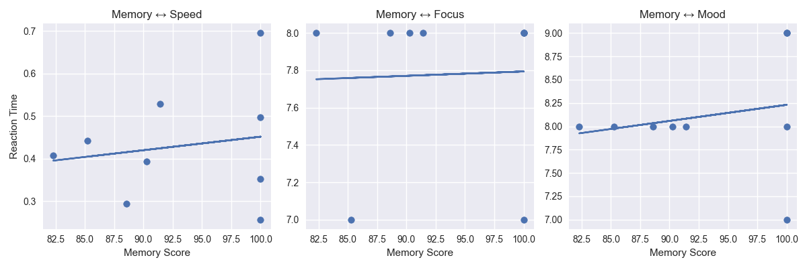
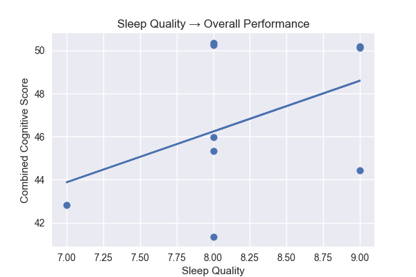

# Sleep and Cognitive Tracking System

## Abstract

This project investigates how sleep patterns, screen exposure, mood, and cognitive performance are related over time. A Python based data collection system was used to record daily sleep habits and compare them with cognitive task performance including reaction time and working memory performance. The collected dataset was analyzed to identify possible relationships between sleep quality, memory retention, and cognitive speed under real-world conditions.

---

## Objective

To explore possible relationships between sleep habits, screen time, mood, and cognitive performance and understand how daily lifestyle factors influence reaction speed and memory performance.

---

## Experimental Design

The system collected daily self-recorded data along with performance based cognitive tests.

### Sleep Tracking Phase
Participants recorded:
- Sleep duration
- Sleep and wake times
- Screen time before sleep
- Sleep quality rating
- Wake-ups during night
- Time taken to fall asleep
- Mood and focus ratings

### Cognitive Testing Phase
Participants completed:
- Reaction time test (5 rounds averaged per day)
- Working memory task with sequence recall under interference conditions

---

## Participants and Sessions

The dataset was collected over:
- 10 days (May 2 to May 11)
- Single participant (self-tracked study)
- Repeated daily cognitive + sleep measurements

---

## Variables Measured

- Sleep Hours
- Sleep Quality
- Screen Time before sleep
- Time to fall asleep (Sleep Latency)
- Mood
- Focus
- Reaction Time Average
- Memory Score (%)

---

## Methodology

Daily sleep data was manually recorded and stored in CSV format. Cognitive performance was measured using Python based reaction time tests and working memory recall tasks.

All datasets were merged into a single structured dataset (`final_data.csv`) to analyze relationships between sleep behavior and cognitive performance.

---

## Technologies Used

- Python
- Pandas
- NumPy
- Matplotlib
- CSV based logging system

---

## Results

### Reaction Time vs Sleep Variables

#### Sleep Hours → Reaction Time

Higher sleep duration generally showed improved reaction speed (lower reaction time).

#### Sleep Quality → Reaction Time

Better sleep quality showed more stable and slightly faster reaction times.

#### Screen Time → Reaction Time

Higher screen exposure before sleep showed slightly slower reaction times.

---

### Memory Performance vs Sleep

#### Sleep Hours → Memory Performance

Improved sleep duration generally correlated with higher memory recall scores.

#### Sleep Quality → Memory Performance

Higher sleep quality showed stronger and more consistent memory retention.

#### Sleep Latency → Memory Performance

Longer time to fall asleep was associated with slightly reduced memory performance.

---

### Cognitive Relationships

#### Memory vs Reaction Time

Higher memory performance generally aligned with faster reaction times.

#### Memory vs Focus

Better memory scores were associated with higher focus ratings.

#### Memory vs Mood

Positive mood levels showed mild positive correlation with memory performance.

---

### Overall Cognitive Performance Model

#### Sleep Quality → Combined Cognitive Score

Sleep quality showed a consistent relationship with overall cognitive performance combining memory and reaction speed.

---

## Observations and Interpretation

The results suggest a consistent relationship between sleep behavior and cognitive performance. Better sleep quality and longer sleep duration generally corresponded to improved memory performance and faster reaction times.

Screen time before sleep appeared to have a negative effect on cognitive speed, while sleep latency showed weaker but noticeable influence on memory retention.

Memory performance also showed a relationship with focus and mood, suggesting that cognitive performance is influenced not only by sleep but also by short term psychological state.

Although this is a small scale dataset, clear directional trends were observed across multiple cognitive dimensions.

---

## Limitations

- Small sample size (single participant)
- Short tracking duration (10 days)
- Self-reported sleep metrics
- Limited environmental control
- No external validation of sleep quality

---

## Future Scope

- Larger participant base
- Automated sleep tracking using wearable devices
- Long-term cognitive trend analysis
- Addition of stress and diet variables
- Machine learning based prediction of cognitive performance

---

## Conclusion

This project demonstrates how daily sleep behavior is linked to cognitive performance metrics such as memory retention and reaction time. The analysis suggests that sleep quality and duration play a key role in maintaining stable cognitive function, while poor sleep patterns and high screen exposure may negatively influence performance.

The system provides a foundational framework for understanding real-world cognitive performance using simple self-collected behavioral data combined with computational analysis.